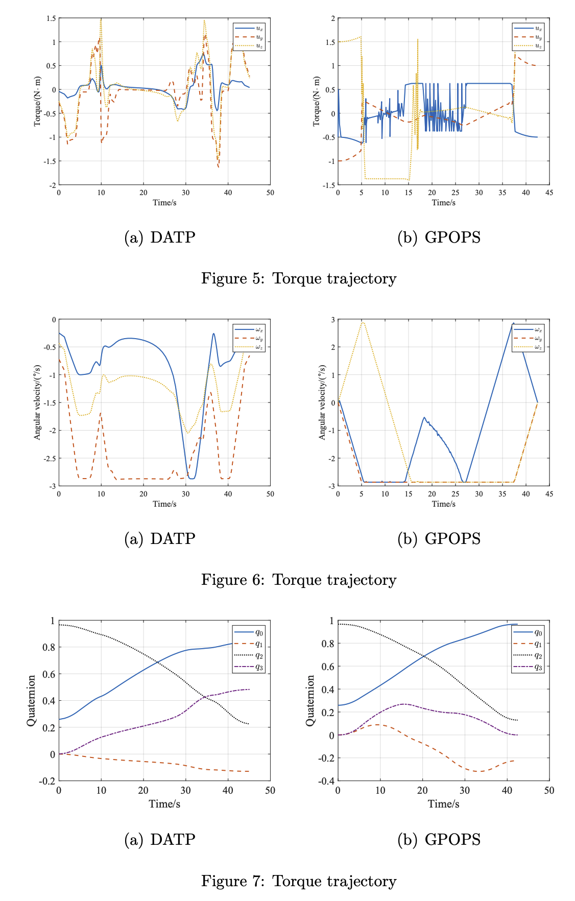

## Abstract
The objective of this paper is to plan a time-optimal attitude trajectory in a relatively short time for spacecraft with movable parts under complex pointing constraints. The constrained attitude planning problem is first established, then the constraints on attitude maneuvers are described. The time-optimal attitude planning for rigid spacecraft body is decoupled into geometric level and dynamic level through the addition of the path scalar. To obtain a given safe path in quaternion space, RRT*-Smart path planning and spherical and quadrangle (SQUAD) interpolation are carried out at the geometric level. The timeoptimal parameterization for a given path is reformulated as a second order cone programming (SOCP) problem at the dynamic level through a nonlinear change in variables and the addition of various convexity-preserving extensions. In order to overcome the issue of high system dimension caused by the movable parts, a decoupled attitude planning method is designed to generate the quaternion trajectory of the spacecraft body and the rotation angle trajectory of the movable parts respectively. In comparison to GPOPS, the simulation results demonstrate that the proposed method can plan a suboptimal solution in milliseconds. Furthermore, the performance indicator for energy consumption is better.

## Simulation Results

