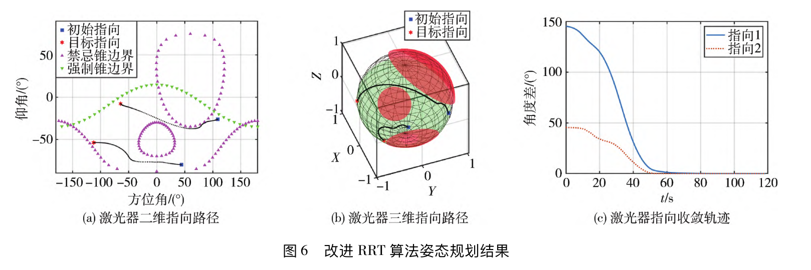
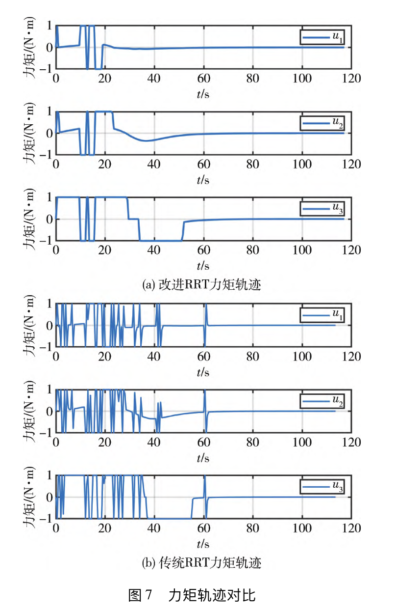

## 仿真结果

使用经典RRT算法和改进RRT算法进行姿态规划，仿真结果如下：

{}
Create your slides in Markdown - click the *Slides* button to check out the example.
{}

Add the publication's **full text** or **supplementary notes** here. You can use rich formatting such as including [code, math, and images](https://docs.hugoblox.com/content/writing-markdown-latex/).
